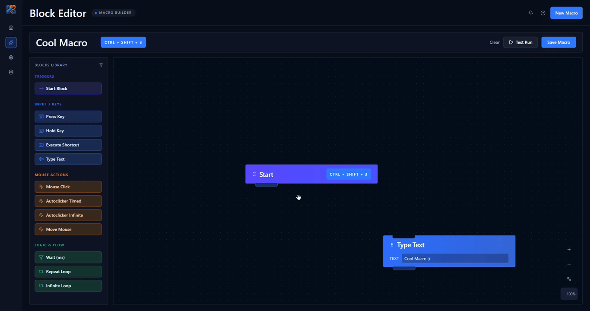
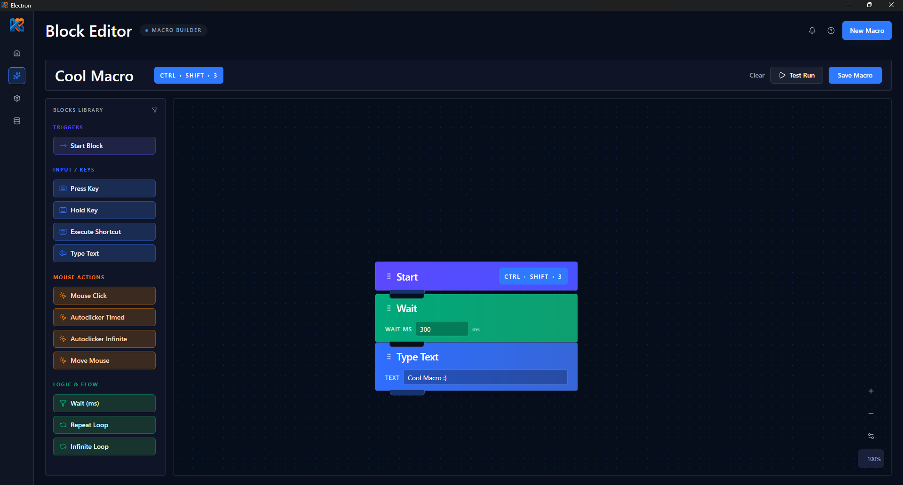
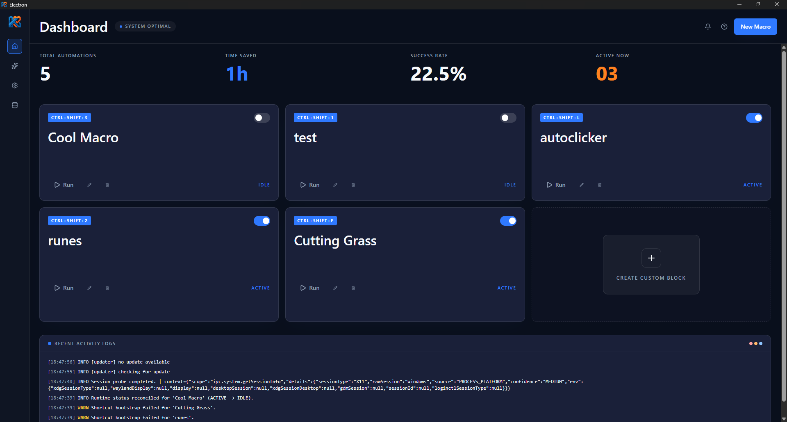
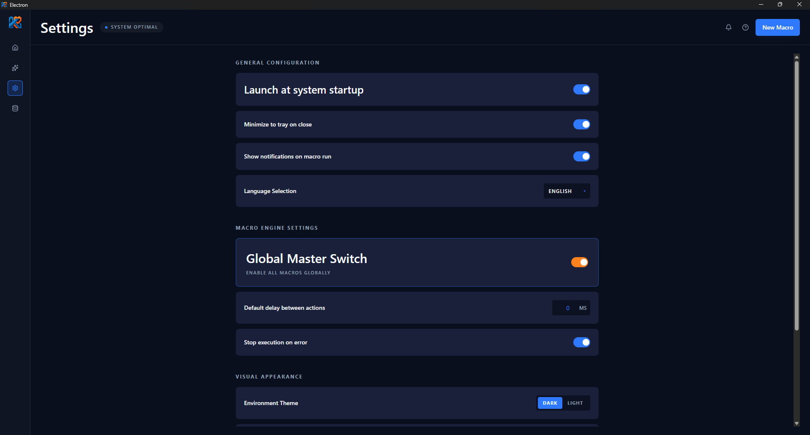

# Keybrix

Keybrix lets you automate your computer without writing code.
Build shortcuts and actions visually using blocks - fast, intuitive, and beginner-friendly.

[](https://github.com/Jakub-Pujanek/Keybrix/releases)
[](#license)

## Demo

See the new app walkthrough GIF below:



## Screenshots / GIFs

Screenshots from the current `resources` folder showing the core app views.

### Block editor



### Dashboard



### Settings window



## Why Keybrix?

- automate repetitive daily tasks
- launch apps or workflows with one shortcut
- chain multiple system actions
- create macros without scripting
- perfect for non-programmers

## Features

- scratch-like block editor - drag and drop, zero coding
- custom actions - combine system actions into workflows
- global shortcuts - trigger actions from anywhere
- cross-platform - Windows, macOS, Linux
- open-source - transparent and community-driven
- repetitive task automation - save time on daily routines
- system integrations - connect actions with desktop behavior

## Installation

Download the latest build from Releases:

- https://github.com/Jakub-Pujanek/Keybrix/releases

Supported platforms:

- Windows
	- `Keybrix-Setup.exe` (replace with your real release asset link)
- macOS
	- `Keybrix.dmg` (replace with your real release asset link)
- Linux
	- `Keybrix.AppImage` or `.deb` (replace with your real release asset link)

## Usage

1. Launch the app and open the block editor.
2. Add a new shortcut from the shortcuts list or settings.
3. Build an action by dragging blocks and configuring their parameters.
4. Save and assign the shortcut so it works globally in your system.
5. Run the action using the shortcut or directly from the app.

## Roadmap

Planned additions:

- [ ] `if` block
- [ ] system integrations
- [ ] plugins

## Tech Stack

- Electron
- React
- TypeScript
- Vite
- Electron Builder

## Contributing

Bug reports, feature ideas, and pull requests are welcome.

- report bugs and ideas via Issues
- open pull requests against `main`
- follow the existing TypeScript, React, and ESLint style in the project
- keep commit messages short and specific

## Development

```bash
npm install
npm run dev
npm run build
```

## License

MIT
